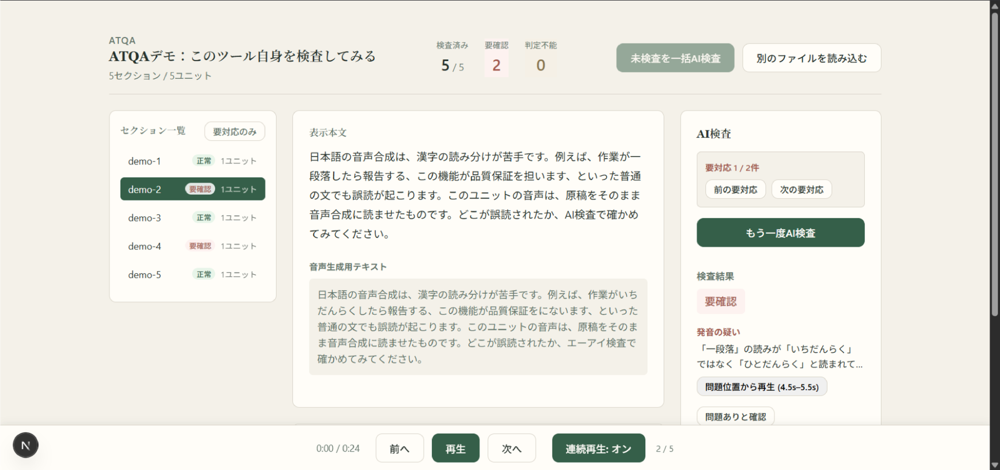
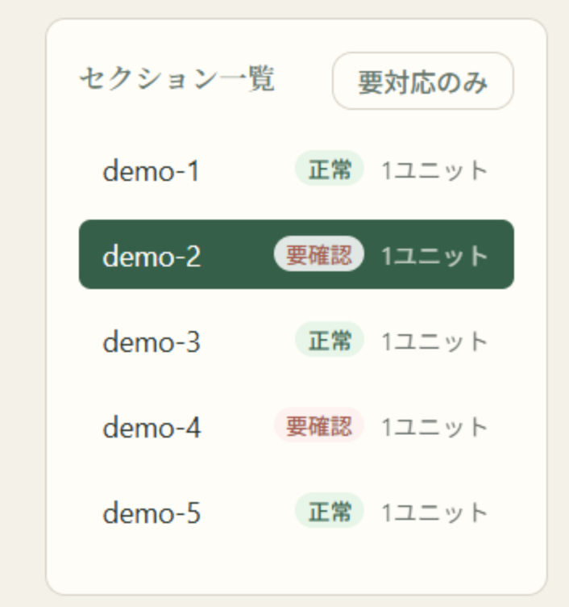
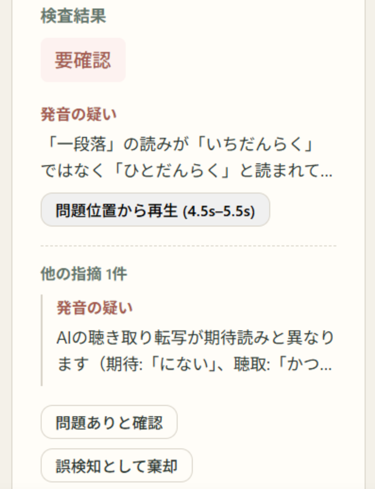

# ATQA

Autonomous TTS Quality Assurance Agent（ATQA）は、既存のクラウド音声と読み上げ原稿をAIで検査し、人が全文を試聴する作業を「要確認箇所だけを聞く作業」へ変えるWebプロトタイプです。

> **全文を聞くQAから、AIが示した場所を判断するQAへ。**

AI Native UX 2026 — AI Designathon @ MERGE 2026（DESIGN ENGカテゴリ）提出作品。

## デモ

- 🎬 **デモ動画**: https://youtu.be/m-2JO4h7m0A
- 📄 **ピッチ資料**: [docs/pitch/ATQA_DESIGN_ENG_Pitch.pdf](docs/pitch/ATQA_DESIGN_ENG_Pitch.pdf)

### スクリーンショット

| ワークスペース全体 | セクション一覧 | AI検査結果 |
|---|---|---|
|  |  |  |

左：本文・音声生成用テキスト・AI検査を1画面に集約したワークスペース。中央：セクションごとの検査状態（正常／要確認）。右：発音の疑いを根拠と再生位置（4.5s–5.5s）付きで提示し、人が「問題あり」「誤検知」を判断します。

## 機能

- **コンテンツ正規化**: Sokqa形式のdocument/quiz JSONを再生ユニットに正規化
- **連続再生**: セクション間の自動再生、シーク、ナビゲーション
- **2段階AI検査**:
  - Stage 1: 読み上げ原稿の決定的比較
  - Stage 2: Cloud STT + Gemini による実音声レビュー
- **保守的判定**: pass / review / inconclusive の3状態、不明な場合は決してpassにしない
- **タイムスタンプシーク**: 問題の場所から直接再生
- **人間確認状態**: AI判定とは別の確認済みマーク

## クイックスタート

### 必要条件

- Node.js 22+
- pnpm 9+
- Google Cloud プロジェクト（Speech-to-Text V2, Vertex AI 有効化済み）

### インストール

```bash
pnpm install
```

### 環境変数

```bash
export GOOGLE_CLOUD_PROJECT=your-project-id
export GOOGLE_CLOUD_LOCATION=us-central1
export GEMINI_MODEL=gemini-2.5-flash
export ALLOWED_AUDIO_HOSTS=cdn.convly.jp
export ASR_CONFIDENCE_THRESHOLD=0.75
```

### 開発サーバー

```bash
pnpm dev
```

http://localhost:3000 にアクセス

## テスト

```bash
# ユニット・統合テスト
pnpm test

# E2Eテスト
pnpm exec playwright install chromium
pnpm test:e2e

# 型チェック
pnpm typecheck

# Lint
pnpm lint
```

## デプロイ

```bash
# コンテナビルド
gcloud builds submit --tag gcr.io/PROJECT_ID/atqa

# Cloud Run デプロイ
gcloud run deploy atqa \
  --image gcr.io/PROJECT_ID/atqa \
  --platform managed \
  --region us-central1 \
  --allow-unauthenticated
```

詳細は [docs/operations.md](docs/operations.md) を参照。

## ドキュメント

- [MVP設計仕様書](docs/superpowers/specs/2026-07-27-atqa-mvp-design.md)
- [実装計画](docs/superpowers/plans/2026-07-27-atqa-mvp-implementation.md)
- [プロセスログ（AI対話記録・時間短縮指標）](docs/process-log.md)
- [ブレスト・UX検討の成果物](docs/brainstorm/)
- [運用ガイド](docs/operations.md)
- [デモスクリプト](docs/demo-script.md)

## プロダクトの約束

ATQAは音声品質の完全自動保証を主張しません。Cloud Speech-to-Text、決定的な読み比較、Geminiによる音声レビューを組み合わせ、誤読の可能性がある場所を根拠と再生位置付きで絞り込みます。

## 対象イベント

AI Native UX 2026 — AI Designathon @ MERGE 2026

## ライセンス

[MIT License](LICENSE)

